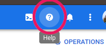

# About Kubernetes materials
_**First you should be familiar with Docker. It is base knowledge!**_

That's our K8b schema:

## Manual GKE Usage (Learning in the end of this file)
1. Deploy DB — postgresSQL
   first: `kubectl apply -f ./k8b/db/pg-config.yaml -f ./k8b/db/pg-deploy.yaml -f ./k8b/db/pg-service.yaml` or `kubectl apply -f ./k8b/db/`
2. Deploy rest-api: `kubectl apply -f ./k8b/rest/rest-deploy.yaml -f ./k8b/rest/rest-service.yaml` or `kubectl apply -f ./k8b/rest/`
3. Connect local machine to remote API pods:
   - Do port forwarding: `kubectl port-forward API_POD_NAME 8080:8080`
   - Do GET request to localhost:8080
4. Check rest-api in internet:
   - find external ip: `kubectl get services`
   - Do GET request to EXTERNAL_IP_ADDRESS:8080
5. Delete all deploys from Kubernetes cluster: `kubectl delete -f ./k8b/ --recursive`

**Also, you can connect local machine to PostgreSQL in pod:**
  - check the port 5432, is it free? Should be free!
  - do port forwarding: `kubectl port-forward PG_POD_NAME 5432:5432`
  - connect: `psql -U testUSER -d testDB -h 0.0.0.0`

**Also, you can connect to container which running in the pod:**
- If it's only one container in the pod: `kubectl exec -it POD_NAME -- /bin/sh`
- If there are several containers in the pod: `kubectl exec -it POD_NAME --container CONTAINER_NAME -- /bin/sh`

**How to check PERSISTENT VOLUMES:**
  - `kubectl get pvc` — get all volume claims
  - you can check mounted dir from postgres container: `kubectl exec -it pg-0 -- /bin/sh -c 'ls $PGDATA'`

## Learn Kubernetes

### First steps:
1. What is the Kubernetes? Read the [official docs](https://kubernetes.io/docs/concepts/overview/what-is-kubernetes/) (multilingual)
2. What is the Google Kubernetes Engine (GKE) [docs](https://cloud.google.com/kubernetes-engine/docs/concepts/kubernetes-engine-overview).
3. Понять варианты группы [API version](https://kubernetes.io/docs/reference/generated/kubernetes-api/v1.23/#-strong-api-groups-strong-) 
4. Other **useless!** links:
    - [Habr Руководство по Kubernetes1](https://habr.com/ru/company/ruvds/blog/438982/). Общие принципы.
    - [Habr Руководство по Kubernetes1](https://habr.com/ru/company/ruvds/blog/438984/). Создаем кластер локально.
5. Useful links:
    - GKE tutorial, [create & deploy app](https://cloud.google.com/kubernetes-engine/docs/tutorials/hello-app)
    - **Best** GKE tutorial "Creating and deploying a containerized web app", steps to find it:
      - [visit your cloud console](https://console.cloud.google.com/)
      - Push the question mark
        
        
      - Chose "Start tutorial"
      - Then, find "Try Kubernetes Engine" → push
    - [Работа с объектами Kubernetes](https://kubernetes.io/ru/docs/concepts/overview/working-with-objects/)
    - **Tutorial** [StatefulSet Basics](https://kubernetes.io/docs/tutorials/stateful-application/basic-stateful-set/)
    - [Declarative Management of Kubernetes Objects Using Kustomize](https://kubernetes.io/docs/tasks/manage-kubernetes-objects/kustomization/)

### Quick tutorials:
1. [From Kubernetes](https://kubernetes.io/uk/docs/tutorials/kubernetes-basics/).
2. [From GKE](https://cloud.google.com/kubernetes-engine/docs/tutorials).

### How to run PostgreSQL in Kubernetes
1. Look up anything about **StatefulSet** in kubernetes
2. Read these articles:
    - [Deploying PostgreSQL as a StatefulSet in Kubernetes](https://www.bmc.com/blogs/kubernetes-postgresql/)
    - [Kubernetes docs about StatefulSet](https://kubernetes.io/docs/concepts/workloads/controllers/statefulset/)

!!!!!! ВСЁ ЧТО НИЖЕ — СЫРЫЕ ДАННЫЕ!!!!!!

2. Хероватая статья про сети и кубернетис (лучше пока не
   нашел) https://www.digitalocean.com/community/tutorials/how-to-inspect-kubernetes-networking-ru
3. !!!! Изучить **когда-нибудь** подробно управление постгресом с помощью специального контроллера,
   который сам разворачивает мастер-слейвы и контролирует нагрузку на экземпляры
   постгреса. https://discuss.kubernetes.io/t/news-kubegres-is-a-kubernetes-operator-for-postgresql/15536
